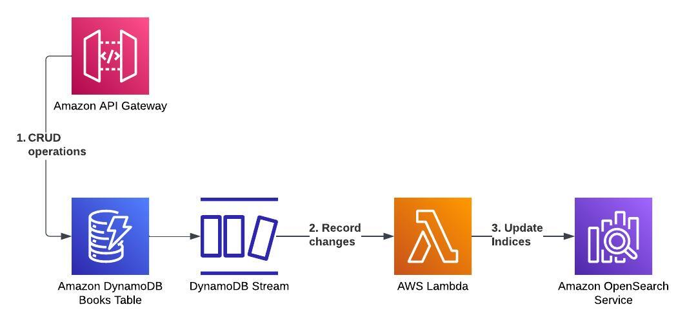

# DynamoDB to Opensearch

This project demonstrates how to automatically update indices in an Opensearch domain in response to CRUD operations against the source-of-truth database, in this case, DynamoDB. This keeps the Opensearch indices in sync with the DynamoDB table.

## Architecture

### Flow
1. CRUD operations from the API Gateway REST API are applied against a DynamoDB table, which has DynamoDB Stream enabled.
2. Record changes in the DynamoDB stream are the event source for a Lambda function.
3. The Lambda function responds to the record change events (insert, update or delete) by updating an index in the Opensearch domain.

### Project Structure

- The project uses Terraform and Terragrunt to provision cloud resources in AWS. The Terraform code is broken into modules in the `modules/` folder, with the Terragrunt code in the `terragrunt/` folder.
- The REST API is implemented with OpenAPI and mapping templates to directly integrate the API with the DynamoDB table.
- The Lambda is written in Python and deployed as a Docker image.
- The Opensearch domain is deployed as a public domain (no VPC) with a domain policy to allow access from one IP address.

